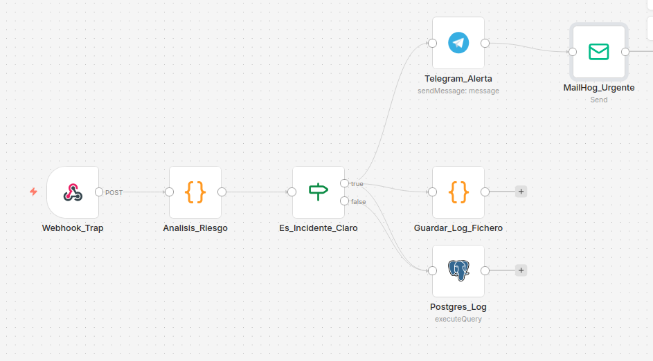

# 🪤 Honey-Trap n8n — Sistema de Detección de Intrusiones

## Estructura del proyecto

```
honeytrap-n8n/
├── docker-compose.yml       # Infraestructura completa
├── WORKFLOW_OFICIAL.json    # Workflow de n8n para importar
├── scripts/                 # Carpeta mapeada al contenedor
│   └── honeytrap.log        # Se genera automáticamente al primer incidente
└── README.md
```

---

## 🚀 Puesta en marcha

### 1. Levantar los servicios

```bash
docker compose up -d
```

### 2. Acceder a n8n

- URL: http://localhost:5678

### 3. Importar el workflow

1. En n8n: **Workflows → Add Workflow → Import from File**
2. Selecciona `WORKFLOW_OFICIAL.json`
3. Configura tus credenciales (Telegram, SMTP, PostgreSQL)
4. Activa el workflow

---

## 📋 Flujo de ejecución

```
Webhook_Trap
    └── Analisis_Riesgo
            └── Es_Incidente_Claro
                    ├── [TRUE - CRITICO]
                    │       ├── Telegram_Alerta → MailHog_Urgente
                    │       ├── Postgres_Log
                    │       └── Guardar_Log_Fichero  ← NUEVO
                    └── [FALSE - BAJO]
                            └── Postgres_Log
```

---

## 📝 Log de fichero

Los incidentes críticos se guardan en `./scripts/honeytrap.log` (persistente en el host).

Formato de cada entrada:
```
============================================================
[2025-01-15T10:23:45.123Z] INCIDENTE CRITICO DETECTADO
IP Origen     : 192.168.1.100
Metodo HTTP   : POST
Ruta accedida : /honey-trap-access
User-Agent    : sqlmap/1.7.8
Severidad     : CRITICO
Body          : {}
Acciones      : Telegram notificado | MailHog enviado | Registro en PostgreSQL
============================================================
```

---

## 🔑 Variable clave en docker-compose

```yaml
- NODE_FUNCTION_ALLOW_BUILTIN=fs,path
```

Esta línea es la que permite usar `require('fs')` en los nodos Code de n8n para escribir el fichero de log.

---

## 🛠 Servicios

| Servicio   | Puerto | Descripción              |
|------------|--------|--------------------------|
| n8n        | 5678   | Interfaz de automatización |
| PostgreSQL | 5432   | Base de datos de incidentes |
| MailHog    | 8025   | Web UI de emails de alerta |
| MailHog    | 1025   | SMTP receptor            |

---

## ⚠️ Herramientas detectadas como CRÍTICAS

El nodo `Analisis_Riesgo` detecta automáticamente:
- `sqlmap` — Inyección SQL
- `nmap` — Escáner de puertos
- `nikto` — Escáner de vulnerabilidades web
- `dirbuster` — Fuerza bruta de directorios
- `wpscan` — Escáner de WordPress

## Imagen del Workflow
